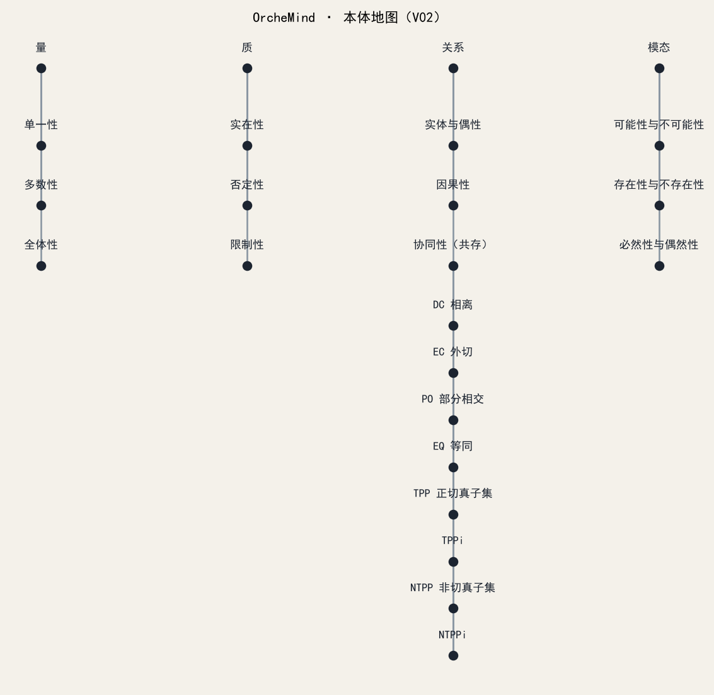
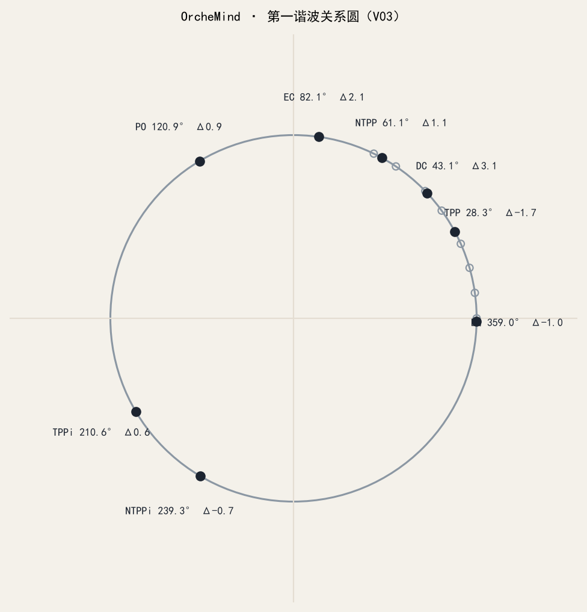

# OrcheMind

以始基本体为根，进化迭代为体，对齐通用大模型为用。

个人自研的可控本体系统：人工定义范畴与关系，按快照增量进化；大模型只做推理与对齐，不微调。当前阶段已固化 V01 裸拓扑、V02 有类型连线与 V03 残差旋转嵌入（含 Luxray 对齐），并可用本地页面查看本体地图与第一谐波关系圆。

理论整理见 [`resources/01dialog/summary/OrcheMind开发结论.md`](resources/01dialog/summary/OrcheMind开发结论.md)。阶段记录见 [`docs/roadmap.md`](docs/roadmap.md)。图示约定见 [`docs/figures/README.md`](docs/figures/README.md)。

## 一眼能看懂

当前主展示（与本地 `view/index.html` 同构图）：





各已固化版本的关键图在对应快照页：

- [V01 裸拓扑](snapshot/v01_raw_graph/README.md)
- [V02 有类型连线](snapshot/v02_typed_link/README.md)
- [V03 残差嵌入 + Luxray 对齐](snapshot/v03_embedding_base/README.md)

## 当前进度

| 阶段 | 状态 | 说明 |
| --- | --- | --- |
| V01 `v01_raw_graph` | 已固化 | 康德四大类、十二范畴，RCC8 挂在「协同性（共存）」下；无类型连线 |
| RCC8 公理与抽象三元组 | 已就绪 | 组合表、35 条抽象三元组、10 道组合题 |
| V02 `v02_typed_link` | 已固化 | `has_category` / `has_rcc8` / `inverse_of`，节点端口 |
| 本体视图 | 可用 | 问题当作 Q：地图命中节点与连线；第一谐波圆上标 RCC8 角度 |
| V03 嵌入训练 | 已验收 | 残差旋转 + 过滤 CE/fidelity；Hit@1 35/35；`L_alignment` 接 Luxray nomic 嵌入 |

铁律：快照只读；不重跑会改掉 UUID 的建图脚本覆盖已固化版本；不把 PCB / ODAAF 业务库直接当基础语料；不加载 WN18RR 上的 RotatE 预训练权重进本体；不微调大模型。

## 目录

```text
OrcheMind/
├─ data/
│  ├─ ontology_graph/     # 工作图 v01 / v02 / v03 导出
│  ├─ rcc8/               # 关系、组合表、角度、LLM 对齐目标
│  ├─ triples/            # 抽象三元组与组合题
│  └─ sandbox/            # 本地训练冒烟（默认不入库）
├─ snapshot/              # 只读进化存档（含各版本 figures/）
├─ docs/figures/hero/     # README 首页主图
├─ src/orchemind_graph/   # 图模型、校验、视图、出图
├─ src/orchemind_embedding/
├─ view/                  # 本体地图与关系圆页面
├─ docs/                  # 路线与下一阶段说明
├─ resources/01dialog/    # 讨论纪要与开发结论
├─ requirements.txt
└─ requirements-gpu.txt
```

## 环境

需要 **Python 3.12**（本机示例：`D:\devprog\python312\python.exe`）。不要用尚未有对应 PyTorch 轮子的更新版本起 GPU 环境。

```powershell
cd G:\myfuture\OrcheMind
py -3.12 -m venv venv
.\venv\Scripts\Activate.ps1
pip install -r requirements.txt
```

可选 GPU（RTX 4060，驱动支持 CUDA 12.x）：

```powershell
pip install -r requirements-gpu.txt
```

驱动不必与轮子的 CUDA 小版本完全一致；已验证 `torch 2.11.0+cu128` 可在驱动 577.03 上运行。

Luxray（自建网关，对齐用）可选环境变量：`LUXRAY_API_BASE`、`LUXRAY_API_KEY`、`LUXRAY_EMBED_MODEL`。默认 `http://ai.luxray.hk.cn/v1` 与 `text-embedding-nomic-embed-text-v1.5`。

## 常用命令

均在仓库根目录、已激活 `venv` 下执行。

```powershell
# 校验 V01 / V02（不重建图）
python src\orchemind_graph\validate_v01.py
python src\orchemind_graph\validate_v02.py

# RCC8 组合表与抽象三元组
python src\orchemind_graph\check_rcc8_composition.py

# 本体视图（浏览器打开提示的地址）
python src\orchemind_graph\serve_view.py
# http://127.0.0.1:8765/view/index.html

# V03 残差旋转训练、Luxray 对齐、验收
python src\orchemind_embedding\train_v03.py
python src\orchemind_embedding\fetch_llm_targets.py
python src\orchemind_embedding\train_v03_align.py
python src\orchemind_embedding\eval_v03.py

# 刷新 README / 各版本静态图
python src\orchemind_graph\export_figures.py
```

不要随意执行 `build_v01.py`：它会生成新 UUID，与已固化快照对不上。增量请基于现有 `data/ontology_graph/` 与 `snapshot/`。

## 入库说明

- 入库：源码、`data` 中的图与 RCC8/三元组、`llm_verb_targets.json`、`snapshot`（含 `figures/`）、`docs/figures/hero/`、`view`、`docs`、讨论纪要 Markdown、开发结论。
- 不入库：`venv/`、豆包整页 HTML 及附属静态资源、本地 `llm_cache` / `sandbox` 大文件、密钥与 `.env`。详见 [`.gitignore`](.gitignore)。

