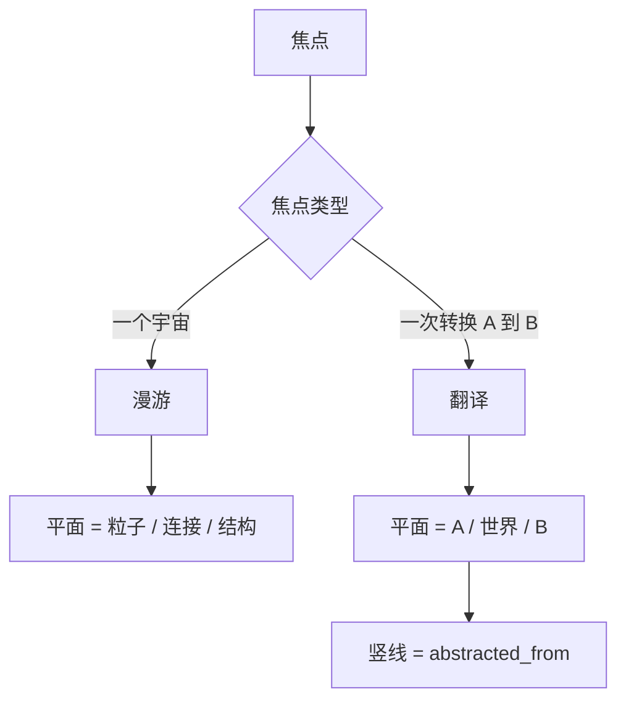

# 04 呈现

## 焦点决定模式

| 模式 | 何时 | 平面（Z）代表 | 重点 |
|---|---|---|---|
| 平面 | 默认 | 无（倾角 0） | 现有二维星系图 |
| 漫游 | 焦点在一个宇宙内部（例：CNC） | 知识层：粒子 / 连接 / 结构 | 内部结构；其它宇宙不显示 |
| 翻译 | 焦点是一次转换（例：CNC → XML） | 源视图 / 世界 / 目标视图 | 哪里对上、哪里缺口、裁判发现了什么 |

## 2.5D 平面堆叠

参考 Fung, Hong 等 2008，《2.5D Visualisation of Overlapping Biological Networks》：几张网络各占一个平行平面，共有部分用竖线连起来。芯片和 PCB 的"叠层加过孔"是同一种形态。

- 每个平面一个仿射变换：竖向压扁 \(\cos\theta\)，再按层号上移固定间距。倾角 \(\theta = 0\) 时就是现在的二维图。
- 变换可逆，点击命中先逆变换回平面坐标。
- 平面内仍用现有星系布局；节点只是换了所在平面。
- 跨层边画成竖线（漫游模式：层间连接；翻译模式：`abstracted_from`）。层间连接少，所以竖线少、清楚。
- 画平面底板；从远到近绘制（先底层平面）。

## 漫游模式

- 只取焦点宇宙内的类；分层按焦点范围计算（[02-knowledge-layers.md](02-knowledge-layers.md)），所以最小粒度随焦点变化。
- 三个平面自下而上：粒子、连接、结构。
- 验收：选中 CNC 内某类后，只显示 CNC 宇宙，分成三层；倾角 0° 与 45° 两张截图；位置锁定仍有效。

## 翻译模式

- 输入源宇宙与目标宇宙。
- 三个平面自下而上：源、世界、目标。只放世界里被源或目标抽象到的叶子。
- 源和目标的节点放在各自世界叶子正上方或正下方，让竖线尽量垂直、交叉最少。
- 三类标注：
  - **已对上**：源和目标都有叶子抽象自同一片世界叶子；
  - **缺口**：只有一端抽象到这片世界叶子；
  - **私有**：没有 `abstracted_from` 的视图叶子，放在平面边缘并淡化。
- 裁判发现标在对应的边上。
- 验收：CNC → XML 图里，孔、铜层、焊盘、钻刀几组竖线清楚；缺口列表与裁判输出一致。

## 交互

- 工具栏：模式（平面 / 漫游 / 翻译）和倾角滑块。
- 脚本自检参数：`--mode plane|roam|translate`、`--tilt <度>`、`--source`、`--dest`（翻译模式的宇宙结构 id；`--target graph` 仍表示只截图形区）；状态文件输出平面数与每层节点数。
- 沿用：位置锁定、广角、拖动、`--select` 跳转。

## 3D 的分工

ODAAF 只做 2.5D 和编辑。全局 3D 总览由 OMStudio 承担，见 [06-3d-overview.md](06-3d-overview.md)。
