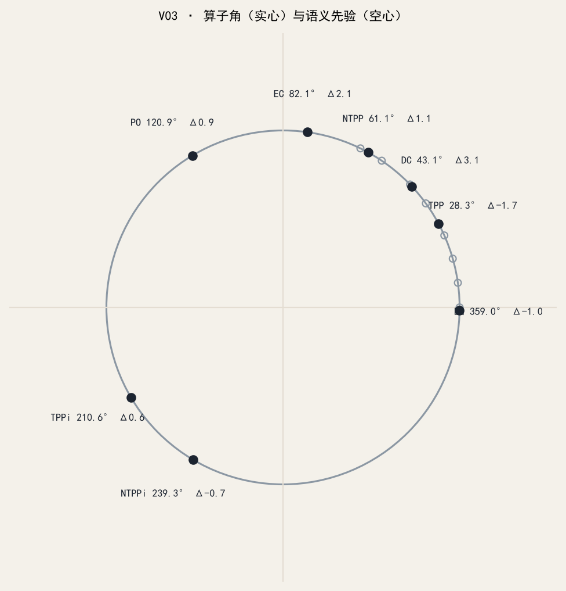

V03 嵌入基线，只读。

- 语义扇区展示角：`data/rcc8/angles_f0.json`（视图空心点）
- 旋转算子先验：`data/rcc8/operator_prior.json`（EQ≈0，逆对约差 180°）
- 训练：过滤式全实体 CE + fidelity；各复维可散开，展示角拉回先验
- 对齐：`L_alignment` 经 `W_align` 对齐 Luxray `text-embedding-nomic-embed-text-v1.5` 冻结目标（`data/rcc8/llm_verb_targets.json`），不微调大模型
- 验收：算子漂移 ≤8.5°；过滤 Hit@1 35/35
- 权重在 `data/sandbox/v03/`（默认不入库）



